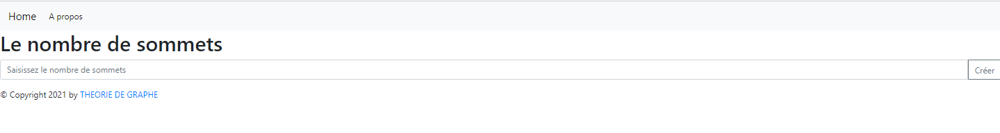

# THG
In this repository, I used python to build a backend of simple website for Algorithm of Bellman Ford ,Djekstra and represention of this graph.
*********************************************************************************************************************************************
Requirement:
You have to install this packages:
1) pip install flask
2) pip install matplotlib
3)	pip install networkx 
4)	pip intall Flask-Session
*********************************************************************************************************************************************
Follow this steps:
1) In your teminal, enter to this folder and write this command to start application: FLASK RUN
2) Enter to 127.0.0.1:5000 
*********************************************************************************************************************************************
1) First, here you have to enter the number of summits:

2) Second,  Fill the matrix (must be connex, if it's not,an error will be shown ) and choose an Alogrithm, here we have an example:

2) 1) here an example of Bellman Ford Algorithm

2) 2) Shortest path from the source (racine) to the last summit:

2) 3) If you clicked on the GRAPHE your graph will be shown(same thing with Djakstra):
2) 1) here an example of Djakstra Algorithm

2) 2) Shortest path from the source (racine) to the last summit:

2) 3)If you clicked on the GRAPHE your graph will be shown(same thing with Bellman-Ford):

